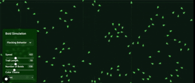

# Boid Simulation

A simple implementation of Craig Reynolds' Boids algorithm for simulating flocking behavior.




## Overview

This simulation demonstrates emergent flocking behavior based on three simple steering rules:

1. **Cohesion** - Boids tend to fly toward the center of mass of nearby flockmates  
2. **Alignment** - Boids tend to align their velocity with nearby flockmates  
3. **Separation** - Boids avoid getting too close to nearby flockmates  


## How It Works

Each boid follows three simple rules on every update:

### 1. Cohesion
Boids try to move toward the average position of nearby boids:
```js
for each boid in neighbors:
    sum position of neighbors

averagePosition = sum / count

desired = averagePosition - boid.position
desired = normalize(desired) * maxSpeed

steer = desired - boid.velocity
steer = limit(steer, maxForce)
```

### 2. Alignment  
Boids try to align their velocity with nearby boids:
```js
for each boid in neighbors:
    sum velocity of neighbors

averageVelocity = sum / count
averageVelocity = normalize(averageVelocity) * maxSpeed

steer = averageVelocity - boid.velocity
steer = limit(steer, maxForce)
```

### 3. Separation  
Boids try to keep a safe distance from nearby boids:
```js
for each boid in neighbors:
    if distance < desiredSeparation:
        diff = boid.position - neighbor.position
        diff /= distance
        sum += diff

averageRepulsion = sum / count
averageRepulsion = normalize(averageRepulsion) * maxSpeed

steer = averageRepulsion - boid.velocity
steer = limit(steer, maxForce)
```

## References

- Reynolds, C. W. (1987). "Flocks, herds and schools: A distributed behavioral model." *SIGGRAPH '87: Proceedings of the 14th Annual Conference on Computer Graphics and Interactive Techniques*, 21(4), 25-34. [https://doi.org/10.1145/37401.37406](https://doi.org/10.1145/37401.37406)  
- Reynolds, C. W. "Boids: Background and Update." [https://www.red3d.com/cwr/boids/](https://www.red3d.com/cwr/boids/)
- Video from The Coding Train [video](https://youtu.be/mhjuuHl6qHM?si=odg4IMZvjNfuVH39)

